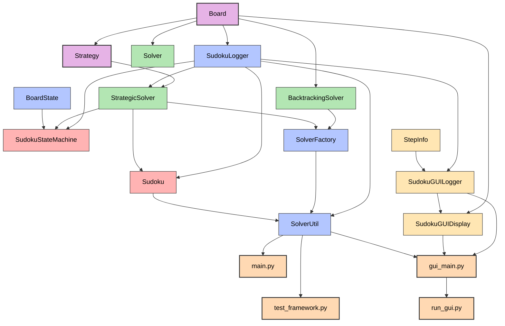

# Sudoku Saga

## Project Overview
A Python-based Sudoku solver implementing various solving techniques from basic to advanced strategies. The project follows a structured approach using both backtracking and strategic methods, with a comprehensive set of solving strategies organized by complexity level. The solver features a centralized logging system for better output control and improved user experience, and now includes an interactive GUI visualization for step-by-step solving process observation.

## Directory Structure
```
sudoku/
├── board/
│   ├── board.py        # Main Board class implementation
│   ├── validator.py    # Validates Sudoku board state
│   └── colors.py       # ANSI color handling for display
├── display/            # GUI visualization package
│   ├── __init__.py     # Package initialization
│   ├── gui_display.py  # GUI visualization classes
│   ├── gui_main.py     # Entry point for GUI visualization
│   └── README.md       # Documentation for GUI visualization
├── solvers/
│   ├── solver.py          # Base Solver class
│   ├── solver_factory.py  # Factory for creating solver instances
│   ├── backtracking_solver.py  # Recursive backtracking implementation
│   ├── strategic_solver.py     # Strategy-based solving
│   └── csp_solver.py          # Constraint satisfaction solver
├── strategies/
│   ├── strategy.py        # Base Strategy class
│   ├── single_candidate.py
│   ├── hidden_singles.py
│   ├── pointing_pairs.py  # Recently implemented
│   ├── box_line_intersection.py  # Recently implemented
│   ├── naked_pairs.py
│   ├── hidden_pairs.py
│   ├── naked_triples.py
│   ├── hidden_triples.py
│   ├── naked_quads.py
│   └── hidden_quads.py
├── sudoku/
│   ├── sudoku.py      # Main game logic and state machine
│   ├── solver_util.py # Utility functions for solving
│   └── logger.py      # Centralized logging system
├── test/
│   └── test_framework.py  # Comprehensive testing framework
├── puzzles/
│   ├── sudoku.csv          # Database of 1M puzzles
│   ├── extract_puzzles.py  # Puzzle processing
│   └── selected_puzzles.json  # Curated test cases
├── documentation/
│   └── PROJECT.md          # Project documentation
├── requirements.txt        # Project dependencies
└── run_gui.py              # Launcher script for GUI visualization
└── main.py                 # Launcher script for CLI Version
```

## Data Flow
1. Puzzle Input
   - Represented as 81-character string (0-9, 0 for empty)
   - Board class converts to 2D grid with candidate tracking
2. Solver Selection and Initialization
   - Factory creates appropriate solver instance
   - Initializes strategy hierarchy for strategic solving
3. Logger Creation
   - Creates a logger instance based on verbosity settings
   - For GUI visualization, creates a SudokuGUILogger that captures step history
4. Strategic Solving Process
   - Strategies applied from simplest to most complex
   - Each strategy either places values or eliminates candidates
   - Process continues until solved or unsolvable
   - For GUI visualization, each step's state is captured and stored
5. State Machine Control
   - Manages solving process through defined states
   - Handles strategy selection and application
   - Tracks solving progress and completion
6. Output Generation
   - Logger formats and displays the solving process
   - Provides summary of strategies used
   - For GUI visualization, displays the solving process step by step with interactive controls

## Main Classes and Functions

### Board Class (board/board.py)
- Manages grid representation and candidate tracking
- Provides validation and visualization functions
- Key methods:
  ```python
  - update_candidates_on_insert(row, col)
  - check_placement(row, col, value)
  - display_board()
  ```

### Solver Hierarchy
- **Solver** (solvers/solver.py) - Base abstract class
- **SolverFactory** (solvers/solver_factory.py) - Creates appropriate solvers
- **BacktrackingSolver** (solvers/backtracking_solver.py) - Uses recursive backtracking
- **StrategicSolver** (solvers/strategic_solver.py) - Uses human-like strategies
  - Now integrated with centralized logger
  - Tracks update types (elimination or insertion)


### Strategy Hierarchy
- **Strategy** (strategies/strategy.py) - Base class for all strategies
  - **SingleCandidateStrategy** - Finds cells with only one possible value
  - **NakedPairsStrategy** - Identifies and applies the Naked Pairs strategy
  - **NakedTriplesStrategy** - Identifies and applies the Naked Triples strategy
  - **NakedQuadsStrategy** - Identifies and applies the Naked Quads strategy
  - **HiddenSinglesStrategy** - Identifies numbers that can only go in one cell in a unit
  - **HiddenPairsStrategy** - Identifies pairs of numbers that can only go in two cells in a unit
  - **HiddenTriplesStrategy** - Identifies three numbers that can only go in three cells in a unit
  - **HiddenQuadsStrategy** - Identifies four numbers that can only go in four cells in a unit

### SudokuLogger (logger.py)
- Centralized logging system for the solving process
- Supports both verbose and non-verbose output modes
- Tracks strategy usage and provides summary statistics
- Key methods:
  ```python
  - log_initial_state(board)
  - log_strategy_found(strategy_name, details)
  - log_strategy_applied(strategy_name, updates, update_type)
  - log_state_change(state, board)
  - log_final_state(board, solved)
  - print_summary()
  ```

### Sudoku (sudoku/sudoku.py)
- Manages the overall game
- Uses a state machine (SudokuStateMachine) to control the solving process
- States:
  - finding_best_strategy
  - applying_strategy
  - checking_if_solved
  - solved
  - unsolvable

### SolverUtil (sudoku/solver_util.py)
- Utility class for solving puzzles
- Creates and configures solvers
- Sets up the centralized logger
- Provides a simplified interface for solving puzzles

## Command-line Interface (main.py)
- Simple interface for solving puzzles from the command line
- Supports various options:
  - Verbose output (-v, --verbose)
  - Custom puzzle input (-p, --puzzle)
  - Puzzle description (-d, --description)
- Example usage:
  ```bash
  python main.py -v -p "puzzle_string" -d "My puzzle"
  ```

## Test Framework (test/test_framework.py)
The project includes a comprehensive test framework for analyzing and validating Sudoku solving strategies.

### Key Features
- **Puzzle Analysis**: Can analyze large batches of puzzles to gather statistics about strategy usage
- **Strategy Testing**: Tests individual strategies and tracks their effectiveness
- **Detailed Logging**: Shows step-by-step solving process with board state and candidates
- **Statistics Collection**: Tracks strategy usage patterns and success rates

### Using the Test Framework
The test framework can be used in several ways:

1. **Analyze Multiple Puzzles**:
   ```bash
   python test/test_framework.py --analyze N
   ```
   Where N is the number of puzzles to analyze (e.g., 100, 1000, etc.)
   Add --verbose for detailed output.

2. **Test a Specific Puzzle**:
   ```bash
   python test/test_framework.py --test "puzzle_string"
   ```
   Where puzzle_string is an 81-character string representing the puzzle (use 0 for empty cells).
   Example:
   ```bash
   python test/test_framework.py --test "000000000001900500560310090100600028004000700270004003040068035002005900000000000"
   ```

3. **Test from JSON File**:
   ```bash
   python test/test_framework.py --test-file path/to/test_cases.json
   ```
   The JSON file should contain an array of test cases with puzzle strings.

### Output Information
The test framework provides:
- Initial board state and candidates
- Step-by-step strategy application
- Board state after each move
- Candidate updates
- Final statistics including:
  - Strategy usage counts
  - Success rates
  - Strategy combinations used

### Results Storage
Analysis results are saved to `puzzles/analysis_results.json`, including:
- Summary statistics
- Strategy counts
- Strategy combinations
- Individual puzzle results

## Project Status
- Core solving strategies implemented and tested
- Centralized logging system implemented
- Test framework complete with comprehensive analysis capabilities
- Successfully solving puzzles of varying difficulty levels
- GUI visualization for step-by-step solving process added

### Implemented Strategies
- [x] Basic Strategies
  - Single Candidate (Naked Singles)
  - Hidden Singles
  - Pointing Pairs
  - Box/Line Intersection
  - Naked/Hidden Pairs
  - Naked/Hidden Triples
  - Naked/Hidden Quads

### In Progress
- [ ] X-Wing Strategy
  - Core algorithm designed
  - Initial implementation started
- [ ] Swordfish Strategy
  - Design phase complete
  - Implementation pending

### Planned Implementations
1. Tough Strategies
   - Simple Coloring
   - Y-Wing
   - XYZ-Wing
   - W-Wing
   - Rectangle Patterns
   - BUG (Bivalue Universal Grave)
2. Diabolical Strategies
   - X-Cycles
   - XY-Chains
   - 3D Medusa
   - Jellyfish
   - Unique Rectangles
3. Extreme Strategies
   - Almost Locked Sets
   - Finned X-Wing/Swordfish
   - Inference Chains
   - Sue-de-Coq
   - Death Blossom

## Implementation Notes

### Strategy Hierarchy
Strategies ordered by complexity and effectiveness:
1. Basic Strategies (implemented)
   - Single candidates
   - Hidden singles
   - Pointing pairs
   - Box/line intersection
   - Naked/Hidden pairs/triples/quads
2. Tough Strategies (in progress)
   - X-Wing and variants
   - Wings (XY, XYZ, W)
   - Rectangle patterns
3. Diabolical/Extreme Strategies (planned)
   - Chains and cycles
   - Advanced pattern recognition
   - Complex inference techniques

### Recent Updates
1. Centralized Logging System
   - Implemented SudokuLogger class for consistent output
   - Added support for verbose and non-verbose modes
   - Integrated with state machine and solver classes
   - Added detailed strategy tracking and summary statistics

2. Command-line Interface Improvements
   - Added support for puzzle descriptions
   - Enhanced verbosity control
   - Improved error handling and user feedback

3. Observer Pattern Refactoring
   - Replaced observer pattern with centralized logger
   - Maintained backward compatibility
   - Simplified code structure and reduced redundancy

4. Performance Optimizations
   - Ordered strategies by computational complexity
   - Optimized candidate elimination routines
   - Enhanced strategy selection process

5. GUI Visualization
   - Added interactive GUI for step-by-step solving visualization
   - Displays board state and candidates at each step
   - Shows strategy application details and updates
   - Features auto-play mode with adjustable speed
   - Highlights cells affected by each strategy

### Testing Framework
Features:
- Puzzle analysis with statistics
- Strategy effectiveness tracking
- Step-by-step visualization
- Performance benchmarking

Usage:
```bash
# Analyze multiple puzzles
python test/test_framework.py --analyze N

# Test specific puzzle
python test/test_framework.py --test "puzzle_string"

# Test from file
python test/test_framework.py --test-file path/to/test_cases.json
```

## Component Interfaces

### Board Interface
```python
Interface: Board
Provided by: Board class (board/board.py)
Used by: Solvers, Strategies, SudokuStateMachine
Methods:
  - __init__(board_string): Initializes board from an 81-character string
  - string_to_board(board_string): Converts string to 2D grid
  - initialize_candidates(): Sets up initial candidates for each cell
  - update_candidates_on_insert(row, col): Updates candidates after value insertion
  - update_candidates_backtracking(): Updates all candidates (for backtracking)
  - is_valid(): Checks if the current board state is valid
  - is_solved(): Checks if the puzzle is completely solved
  - display_board(): Prints the current board state
  - display_candidates(): Prints the current candidates for each cell
Properties:
  - cells: 2D grid of values (None for empty cells)
  - candidates: 2D grid of candidate sets for each cell
  - original: Copy of the initial board state
```

### BoardState Interface
```python
Interface: BoardState
Provided by: BoardState class (sudoku/sudoku.py)
Used by: SudokuStateMachine
Methods:
  - from_board(board, state_name): Class method to create BoardState from a Board
Properties:
  - is_valid: Whether the board state is valid
  - is_solved: Whether the board is solved
  - empty_cells: Number of empty cells remaining
  - state_name: Name of the current state
```

### Strategy Interface
```python
Interface: Strategy
Provided by: Strategy class (strategies/strategy.py)
Used by: StrategicSolver
Methods:
  - __init__(board, name, type): Initializes strategy with board reference
  - process(): Returns List[Tuple[int, int, int]] of updates to make
  - _get_empty_cells_in_unit(unit_type, index): Helper for finding empty cells
  - _get_cells_with_candidate(value): Helper for finding cells with specific candidate
Properties:
  - name: Name of the strategy
  - type: Type of strategy ("Value Finder" or "Candidate Eliminator")
  - board: Reference to the Board object
```

### Solver Interface
```python
Interface: StrategicSolver
Provided by: StrategicSolver class (solvers/strategic_solver.py)
Used by: Sudoku, SudokuStateMachine
Methods:
  - __init__(board, mode, logger): Initializes solver with board and logger
  - is_strategy_based(): Returns True for strategic solvers
  - find_strategy(): Finds the best strategy to apply next
  - apply_strategy(): Applies the current strategy to the board
  - _eliminate_candidates(): Helper for eliminating candidates
  - _insert_values(): Helper for inserting values
Properties:
  - board: Reference to the Board object
  - strategies: List of Strategy objects in order of complexity
  - current_strategy: Currently selected strategy
  - logger: Reference to the SudokuLogger object
  - last_update_type: Type of the last update ("elimination" or "insertion")
```

### SolverFactory Interface
```python
Interface: SolverFactory
Provided by: SolverFactory class (solvers/solver_factory.py)
Used by: SolverUtil
Static Methods:
  - create_solver(board, solverType, mode): Creates and returns a solver instance
    - solverType: "Strategic" (default), "Backtracking", or "CSP"
    - mode: "Default", "Observer", or other modes
```

### Sudoku Interface
```python
Interface: Sudoku
Provided by: Sudoku class (sudoku/sudoku.py)
Used by: main.py, SolverUtil
Methods:
  - __init__(board, solver, logger): Initializes with board, solver, and logger
  - solve(): Solves the puzzle using the state machine
Properties:
  - board: Reference to the Board object
  - solver: Reference to the Solver object
  - solver_state_machine: Reference to the SudokuStateMachine
```

### State Machine Interface
```python
Interface: SudokuStateMachine
Provided by: SudokuStateMachine class (sudoku/sudoku.py)
Used by: Sudoku
Methods:
  - __init__(solver, logger): Initializes state machine with solver and logger
  - solve(): Runs the state machine until puzzle is solved or unsolvable
  - transition_state(): Transitions to the next state based on current state
  - finding_best_strategy(): State handler for finding the best strategy
  - applying_strategy(): State handler for applying the current strategy
  - checking_if_solved(): State handler for checking if the puzzle is solved
Properties:
  - solver: Reference to the Solver object
  - logger: Reference to the SudokuLogger object
  - current_state: Current state of the state machine
  - states: Dictionary mapping state names to handler methods
```

### Logger Interface
```python
Interface: SudokuLogger
Provided by: SudokuLogger class (sudoku/logger.py)
Used by: Sudoku, SudokuStateMachine, StrategicSolver, SolverUtil
Methods:
  - __init__(verbose): Initializes logger with verbosity setting
  - set_board(board): Sets the current board reference
  - log_initial_state(board): Logs the initial state of the board
  - log_strategy_found(strategy_name, details): Logs when a strategy is found
  - log_strategy_applied(strategy_name, updates, update_type): Logs strategy application
  - log_strategy_testing(strategy_name): Logs when a strategy is being tested
  - log_strategy_not_found(strategy_name): Logs when a strategy finds no opportunities
  - log_no_strategies_found(): Logs when no strategies are found
  - log_state_change(state, board): Logs state machine state changes
  - log_solve_check(is_solved): Logs the result of checking if solved
  - log_final_state(board, solved): Logs the final state of the board
  - print_summary(): Prints a summary of the solving process
Properties:
  - verbose: Whether to show detailed output
  - step_counter: Counter for strategy application steps
  - strategies_used: List of strategies used during solving
  - strategy_counts: Dictionary counting strategy usage
  - current_board: Reference to the current Board object
```

### SolverUtil Interface
```python
Interface: SolverUtil
Provided by: SolverUtil class (sudoku/solver_util.py)
Used by: main.py, test_framework.py
Static Methods:
  - create_solver(board, solver_type, mode): Creates a solver instance
  - solve_puzzle(puzzle_str, verbose, description): Solves a puzzle with options
```

### GUI Visualization Interfaces
```python
Interface: StepInfo
Provided by: StepInfo class (display/gui_display.py)
Used by: SudokuGUILogger, SudokuGUIDisplay
Properties:
  - strategy_name: Name of the strategy applied
  - updates: List of updates made (row, col, value) tuples
  - update_type: Type of update ("elimination" or "insertion")
  - board_state: Complete copy of the board state at this step
  - candidates: Complete copy of all candidates at this step
  - description: Human-readable description of the step
  - highlighted_cells: List of cells affected by this step
```

```python
Interface: SudokuGUILogger
Provided by: SudokuGUILogger class (display/gui_display.py)
Extends: SudokuLogger
Used by: gui_main.py, SudokuGUIDisplay
Methods:
  - __init__(verbose): Initializes logger with verbosity setting
  - log_initial_state(board): Captures and logs initial board state
  - log_strategy_found(strategy_name, details): Captures when a strategy is found
  - log_strategy_applied(strategy_name, updates, update_type): Captures strategy application
  - log_final_state(board, solved): Captures and logs final board state
Properties:
  - steps: List of StepInfo objects representing the solving history
  - current_step: Current step being built
```

```python
Interface: SudokuGUIDisplay
Provided by: SudokuGUIDisplay class (display/gui_display.py)
Used by: gui_main.py
Methods:
  - __init__(board, logger): Initializes display with board and logger
  - draw_grid(x_offset, y_offset): Draws the Sudoku grid
  - draw_numbers(x_offset, y_offset): Draws numbers on the board
  - draw_candidates(x_offset, y_offset): Draws candidates for each cell
  - draw_info_panel(): Draws information about the current step
  - draw_buttons(): Draws control buttons
  - update_display(): Updates the display with current step
  - previous_step(): Go to the previous step
  - next_step(): Go to the next step
  - toggle_auto_play(): Toggles auto-play mode
  - increase_speed(), decrease_speed(): Adjust auto-play speed
  - handle_events(): Handle pygame events
  - update_auto_play(): Update auto-play if enabled
  - run(): Runs the visualization loop
  - close(): Closes the pygame display
Properties:
  - board: Reference to the Board object
  - logger: Reference to the SudokuGUILogger object
  - current_step_index: Index of the currently displayed step
  - current_step: Currently displayed step
  - auto_play: Whether auto-play is enabled
  - auto_play_speed: Speed of auto-play in seconds
```

## Component Dependencies

### Direct Dependencies
- Board: Used by Strategy, Solver, SudokuStateMachine, SudokuLogger, Sudoku
- Strategy: Used by StrategicSolver
- StrategicSolver: Uses Strategy, Board, SudokuLogger; Used by Sudoku, SudokuStateMachine, SolverFactory
- SudokuLogger: Uses Board; Used by StrategicSolver, SudokuStateMachine, Sudoku, SolverUtil
- SudokuStateMachine: Uses Solver, SudokuLogger, BoardState; Used by Sudoku
- SolverUtil: Uses Board, SolverFactory, StrategicSolver, Sudoku, SudokuLogger; Used by main.py, test_framework.py
- SolverFactory: Uses BacktrackingSolver, StrategicSolver; Used by SolverUtil
- BoardState: Uses Board; Used by SudokuStateMachine
- Sudoku: Uses Board, Solver, SudokuStateMachine; Used by SolverUtil
- BacktrackingSolver: Uses Board; Used by SolverFactory

### Dependency Flow Diagram


### Key Dependency Relationships

1. **Entry Points**:
   - `main.py`: Command-line interface for solving puzzles
   - `test_framework.py`: Testing framework for analyzing puzzles

2. **Core Components**:
   - `Board`: Central data structure representing the Sudoku grid
   - `Strategy`: Base class for all solving strategies
   - `StrategicSolver`: Implements the strategy-based solving approach
   - `SudokuStateMachine`: Controls the solving process flow
   - `SudokuLogger`: Handles output and tracking of the solving process

3. **Utility Components**:
   - `SolverUtil`: Provides simplified interface for solving puzzles
   - `SolverFactory`: Creates appropriate solver instances
   - `BoardState`: Encapsulates the state of the board at a point in time

4. **Circular Dependencies**:
   - `Sudoku` ↔ `SudokuStateMachine`: Sudoku creates the state machine, which references back to the solver
   - `StrategicSolver` ↔ `Strategy`: StrategicSolver uses strategies, which reference the board from the solver

5. **Dependency Direction**:
   - Most dependencies flow downward from entry points to core components
   - The Board class is used by almost all components
   - The Logger is injected into multiple components for consistent logging

6. **GUI Visualization Components**:
   - `StepInfo`: Data container for each solving step
   - `SudokuGUILogger`: Extends SudokuLogger to capture step history
   - `SudokuGUIDisplay`: Renders the board and provides user interaction
   - `gui_main.py`: Coordinates the solving process and visualization
   - `run_gui.py`: Provides a convenient entry point

## GUI Visualization

The project now includes a graphical user interface for visualizing the Sudoku solving process step by step.

### Features
- **Interactive Controls**: Navigate through solving steps with Previous/Next buttons or keyboard shortcuts
- **Auto-Play Mode**: Watch the solving process automatically with adjustable speed
- **Detailed Information Panel**: Shows strategy name, description, and updates for each step
- **Visual Highlighting**: Highlights cells affected by each strategy application
- **Candidate Display**: Shows candidate numbers for each cell at every step
- **Original vs. Solved Numbers**: Distinguishes between original puzzle numbers and solved numbers

### Using the GUI Visualization
```bash
# Using the run_gui.py script (recommended)
python run_gui.py

# Or directly using the gui_main.py script
python -m display.gui_main

# With custom puzzle
python run_gui.py -p "puzzle_string" -d "Puzzle description"

# With specific solver
python run_gui.py -s "Strategic" -p "puzzle_string"
```

### Architecture and Design
The GUI visualization follows a layered architecture with clear separation of concerns:

1. **Data Layer**: Reuses the existing `Board` class and solving components
2. **Logging Layer**: Extended with `SudokuGUILogger` to capture solving steps
3. **Presentation Layer**: New `SudokuGUIDisplay` class for visualization
4. **Control Layer**: New `StepInfo` class to encapsulate step data

#### State Management
- Complete solving process runs first, capturing all steps
- Each step stores a complete copy of the board state and candidates
- Users can freely navigate through the solving history
- The visualization is decoupled from the solving process

#### Component Interactions
- `SudokuGUILogger` extends the existing logger to capture step data
- `StepInfo` encapsulates all data for a single solving step
- `SudokuGUIDisplay` renders the board, candidates, and step information
- `gui_main.py` coordinates the solving process and visualization
- `run_gui.py` provides a convenient entry point

### Implementation Details
The GUI visualization is implemented using pygame and integrates with the existing logger system. It captures the board state and candidates at each step of the solving process, along with information about which strategy was applied and what updates were made.

The visualization is designed to be educational, allowing users to see exactly how each strategy works and how it affects the board state and candidates.

### GUI Visualization Classes (display/gui_display.py)
- **StepInfo** - Data container for each solving step
  ```python
  - __init__(strategy_name, updates, update_type, board_state, candidates, description)
  - highlighted_cells: List of cells affected by the current step
  ```
- **SudokuGUILogger** - Extended logger that captures steps for visualization
  ```python
  - __init__(verbose): Initializes logger with verbosity setting
  - log_initial_state(board): Captures initial board state
  - log_strategy_found(strategy_name, details): Captures when a strategy is found
  - log_strategy_applied(strategy_name, updates, update_type): Captures strategy application
  - log_final_state(board, solved): Captures final board state
  - steps: List of StepInfo objects representing the solving history
  ```
- **SudokuGUIDisplay** - Manages the pygame display and user interaction
  ```python
  - __init__(board, logger): Initializes display with board and logger
  - draw_grid(): Draws the Sudoku grid
  - draw_numbers(): Draws numbers on the board
  - draw_candidates(): Draws candidates for each cell
  - draw_info_panel(): Draws information about the current step
  - draw_buttons(): Draws control buttons
  - update_display(): Updates the display with current step
  - previous_step(), next_step(): Navigate through steps
  - toggle_auto_play(): Toggles auto-play mode
  - run(): Runs the visualization loop
  ```
